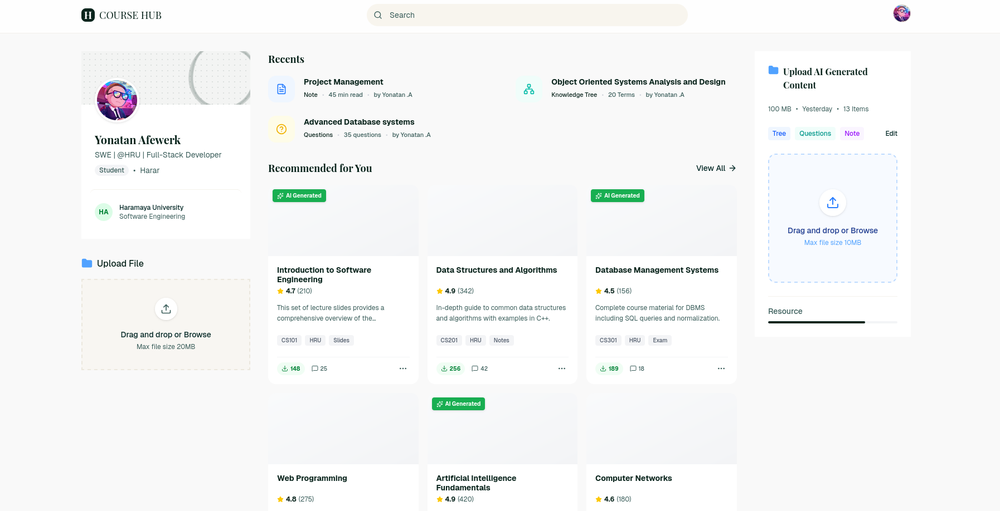
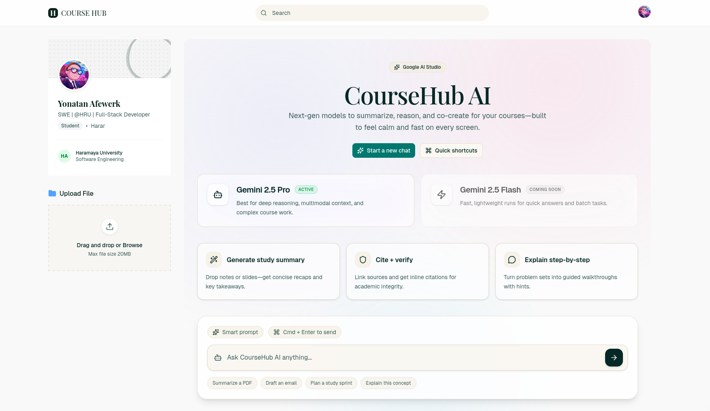
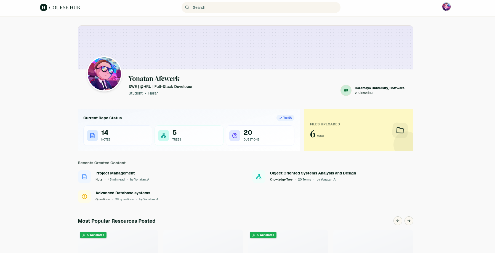
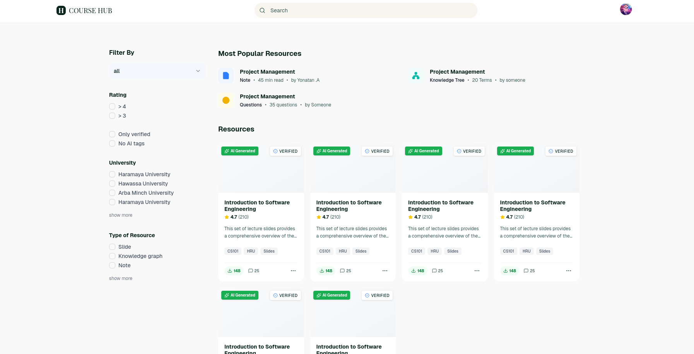

# CourseHub

### System Overview (SRS)

CourseHub is an open-source, centralized adaptive learning platform designed for Ethiopian university students and educators. It centralizes curriculum-aligned resources, supports community moderation, and offers optional AI-powered study aids through the Gemini Studio API. The backend leverages Supabase for authentication, PostgreSQL database, and storage, while the frontend is built with Next.js and Tailwind CSS.

## Preview









### Key Features
- **Authentication**: User registration, email verification, and session management via Supabase Auth (currently have custom auth).
- **Content Submission**: Upload educational resources (e.g., PDFs, docs) with mandatory tagging by course code, semester, and university.
- **Community Moderation**: Ratings (5-star scale), comments, reporting of inappropriate content, and educator-verified tagging for prioritized visibility.
- **AI-Powered Study Aids**: Generate study notes, flashcards, and knowledge trees using the Gemini Studio API, with quota restrictions or subscription-based access.
- **Notifications**: Email/SMS alerts for account verification, password resets, content interactions, and updates on saved or trending materials.
- **Subscription & Premium Access**: Payment module for premium AI features, validated via external gateways.
- **Analytics Dashboards**: University-specific summaries of content uploads and engagement metrics, plus personal contribution statistics.

### High-Level Workflow
1. **User Authentication & Verification**: Register, verify email, and log in to establish session.
2. **Content Upload & Tagging**: Authenticated users upload resources and apply required metadata tags.
3. **Community Moderation and Search**: Search with filters (course, university, tags, semester), rate, comment, and report content.
4. **AI Study Aid Generation**: Use Gemini API to create notes, flashcards, and knowledge trees (subject to quotas).
5. **Notifications Delivery**: Send alerts for interactions, verifications, and reminders.
6. **Optional Subscription/Payment**: Manage premium access and validate subscriptions.
7. **Analytics & Feedback Loops**: View dashboards for insights and continuous improvement.

---

**Functional Requirements (traceable FR-XX)**
### V1.0
- [x] FR-01: Allow users to register using email and password.
- [x] FR-02: Verify user accounts via email using the Notification Service.
- [x] FR-03: Allow users to log in and maintain session state.
- [x] FR-04: Allow users to update their profile information.
- [x] FR-05: Differentiate students and educators via a verification process.
- [x] FR-06: Allow authenticated users to upload educational resources (PDFs, docs).
- [x] FR-06-01: View material on platform, Download material to device.
- [x] FR-06-02: Status names are dynamic (view, download, rating, comments, reports).
- [x] FR-06-03: Crud functionality for uploaded content (edit metadata, delete).
- [x] FR-06-04: You can comment, rate, report and edit/delete(your own) resources 
- [x] FR-06-05: Upload AI generated content with proper tagging and metadata.
- [x] FR-07: Require users to tag uploaded content with course code, semester, and university.
- [x] FR-08: Allow users to download and view publicly available content.
- [x] FR-08-01: Track and store download counts for each resource. 
- [x] FR-09: Provide advanced search filtering using course codes, university, tags, and semester.
    - **Live Global Search**: High-performance, debounced search in the header covering universities and resources. Features client-side caching to minimize database load.
    - **Searchable University Selection**: Advanced combobox for registration and resource uploads with fuzzy matching and "Add New" functionality for missing entries.
- [x] FR-10: Allow users to rate content on a 5-star scale.
- [x] FR-11: Allow users to comment on content.
- [x] FR-12: Allow users to report inappropriate or low-quality content.
- [x] FR-13: Prioritize visibility of content with higher community ratings.
- [x] FR-14: Allow educator-contributors to formally tag and mark content as “verified”.
- [x] FR-15: Allow users to generate AI-based study notes from uploaded content.
- [x] FR-15-01: AI Features should work from AI Page and the AI modals in Resource pages 
- [x] FR-15-02: Support input files in PDF, TXT, MD, and PPTX formats for AI note generation.
- [x] FR-15-03: Take Gemini key from the user and store it locally
- [x] FR-15-04: Allow users to save generated content.
- [x] FR-15-05: Track and limit AI generation requests based on user quotas or subscription status.
- [x] FR-15-06: Allow users to view their AI generation history and saved content.
- [x] FR-15-07: Resource pages display the AI generated content linked with them.
- [x] FR-16: Allow users to generate flashcards and knowledge trees via the Gemini Studio API.
- [x] FR-17: Restrict AI-powered features to free-tier quotas or require subscription for extended use.
- [x] FR-18: Send email or SMS notifications for account verification, password resets, and content interaction events.
- [x] FR-19: Notify users when their content receives a comment, rating, or verification tag.
- [x] FR-19-01: Notification preferences can be managed in user settings.
- [x] FR-19-02: Support opt-in/opt-out for different notification types (email, SMS).
- [x] FR-19-03: Get notified when password changed, preferences updated, subscription status changed.
- [x] FR-20: Send regular updates or reminders regarding saved content and trending materials.
- [x] FR-21: Generate university-specific dashboards summarizing uploaded content and engagement metrics.
- [x] FR-21-01: Allow university staff to edit university information and manage content.
- [x] FR-22: Generate user-specific dashboards summarizing personal contributions and engagement statistics.
- [x] FR-23: Allow users to view their personal content contributions and engagement statistics.
- [ ] FR-24: Support a payment module for subscription to premium AI services.
- [ ] FR-25: Validate subscription status via an external payment gateway.
- [x] FR-26: Restrict access to premium features when subscription inactive/expired.
- [x] FR-27: User settings to manage profile, notification preferences, and subscription details.
- [x] FR-27-01: Allow users to change password, delete account, and manage linked payment methods.

### V2.0
- [ ] FR-28: Allow users to create resource bundles or course packs by grouping multiple learning materials.
- [ ] FR-28-01: Enable one-click download of bundled resources as a single ZIP file.
- [ ] FR-28-02: Support prerequisite linking between resources to show recommended study order.
- [ ] FR-29: Provide public user profiles displaying contributions, ratings, and verification status.
- [ ] FR-29-01: Implement a follow system to notify users when followed contributors upload new content.
- [ ] FR-29-02: Enable peer networking based on university, department, or field of study.
- [ ] FR-30: Support uploading, hosting, and streaming of video lectures.
- [ ] FR-30-01: Automatically generate AI-powered transcripts and summaries for video content.
- [ ] FR-30-02: Allow timestamped comments and questions on video lectures.
- [ ] FR-31: Provide peer-to-peer messaging for direct communication and resource sharing.
- [ ] FR-31-01: Automatically generate course-specific group chats for each course code.
- [ ] FR-31-02: Enable collaborative study rooms with shared documents and whiteboards.
- [ ] FR-32: Implement a reputation system rewarding uploads, helpful comments, and ratings.
- [ ] FR-32-01: Display monthly and all-time leaderboards for top contributors.
- [ ] FR-32-02: Assign verified and master contributor badges to trusted users.
- [ ] FR-33: Provide an internship and job board tailored to students and graduates.
- [ ] FR-33-01: Use platform contributions as proof of skill and knowledge for employers.
- [ ] FR-34: Generate adaptive learning paths based on user behavior and study habits.
- [ ] FR-34-01: Support natural-language, context-aware academic search.
- [ ] FR-35: Provide native mobile applications for Android and iOS.
- [ ] FR-35-01: Enable offline access to downloaded resources and AI-generated notes.
- [ ] FR-36: Support multiple Ethiopian languages including Amharic, Oromiffa, and Tigrinya.
- [ ] FR-36-01: Enable AI-powered translation of resources into supported languages.
- [ ] FR-37: Support a premium resource marketplace for selling high-quality study materials.
- [ ] FR-37-01: Provide subscription tiers with enhanced AI features and storage limits.
- [ ] FR-37-02: Offer white-label platform solutions for universities.
- [ ] FR-38: Implement a peer-review system for validating academic resources.
- [ ] FR-38-01: Integrate plagiarism detection for uploaded content.
- [ ] FR-38-02: Support official university curriculum and course synchronization via APIs.
- [ ] FR-39: Support sponsored challenges and hackathons hosted by industry partners.
- [ ] FR-39-01: Enable educator-based skill endorsements for students.
- [ ] FR-39-02: Provide an AI-curated scholarship and grant tracking system.
- [ ] FR-40: Provide interactive flashcards with spaced repetition.
- [ ] FR-40-01: Implement an AI-powered virtual tutor with step-by-step explanations.
- [ ] FR-40-02: Provide access to digital textbooks and libraries through partnerships.

### V3.0
- [ ] FR-41: Track learning impact by correlating resource usage with user engagement and completion behavior.-
- [ ] FR-41-01: Generate resource effectiveness scores based on views, downloads, ratings, and completion signals.
- [ ] FR-41-02: Provide educators and university staff with AI-generated insights highlighting high-difficulty topics and learner drop-off points.
- [ ] FR-42: Implement advanced content moderation workflows for reported or low-quality resources.
- [ ] FR-42-01: Support community-based moderation roles for trusted and verified contributors.
- [ ] FR-42-02: Maintain version history for edited resources and allow rollback to previous versions.
- [ ] FR-42-03: Support soft-deletion, appeals, and administrative review of moderated content.
- [ ] FR-43: Support official course ownership and content hierarchy per university and department.
- [ ] FR-43-01: Allow educators or departments to mark resources as “official” for a course.
- [ ] FR-43-02: Distinguish between official, verified, and community-contributed resources in course views.
- [ ] FR-43-03: Support semester-based course archival and read-only access to past materials.
- [ ] FR-44: Provide practice-based assessment tools without enabling academic dishonesty.
- [ ] FR-44-01: Support time-limited practice exams using past questions in a simulation-only mode.
- [ ] FR-44-02: Provide AI-generated feedback and hints without revealing final answers.
- [ ] FR-44-03: Allow educators to tag questions by difficulty and learning objective.
- [ ] FR-45: Increase AI transparency and reliability for generated educational content.
- [ ] FR-45-01: Display source references or content chunks used to generate AI responses.
- [ ] FR-45-02: Assign confidence indicators to AI-generated outputs.
- [ ] FR-45-03: Allow users to flag suspected AI hallucinations or incorrect explanations.
- [ ] FR-46: Optimize the platform for low-bandwidth and offline-first environments.
- [ ] FR-46-01: Provide text-only and compressed versions of AI-generated content for low-connectivity users.
- [ ] FR-46-02: Support resumable downloads and background synchronization.
- [ ] FR-46-03: Notify users of critical platform events via SMS or lightweight notification channels when internet access is limited.
- [ ] FR-47: Establish platform governance, transparency, and compliance controls.
- [ ] FR-47-01: Require users to accept platform usage policies and contributor guidelines.
- [ ] FR-47-02: Maintain audit logs for administrative and moderation actions.
- [ ] FR-47-03: Allow users to export their personal data and contributions.

### V4.0
- FR-48: Implement comprehensive security monitoring and abuse prevention mechanisms.
- FR-48-01: Detect and rate-limit suspicious activities such as mass downloads, spam uploads, or automated bot behavior.
- FR-48-02: Log authentication events and critical account actions for security auditing.
- FR-48-03: Notify users of unusual login activity or potential account compromise.
- FR-49: Monitor system health and service availability in real time.
- FR-49-01: Track API performance, error rates, and uptime metrics.
- FR-49-02: Gracefully degrade non-critical features when system load is high.
- FR-49-03: Provide administrators with alerts for critical system failures.
- FR-50: Provide a controlled public API for third-party and institutional integrations.
- FR-50-01: Allow external systems to fetch public resources and metadata via secure endpoints.
- FR-50-02: Support API authentication, rate limiting, and access scopes.
- FR-50-03: Provide API documentation for approved developers and partners.
- FR-51: Support anonymized data exports for educational research and analytics.
- FR-51-01: Allow administrators to generate anonymized datasets for academic studies.
- FR-51-02: Ensure exported datasets comply with privacy, consent, and data protection policies.
- FR-52: Incorporate learning-science-based study support features.
- FR-52-01: Recommend spaced review schedules based on forgetting curve principles.
- FR-52-02: Suggest interleaved practice across related courses or topics.
- FR-52-03: Allow users to reflect on learning sessions via short self-assessment prompts.
- FR-53: Ensure platform accessibility for users with disabilities.
- FR-53-01: Support screen readers, keyboard navigation, and accessible color contrast.
- FR-53-02: Provide captions and transcripts for all video-based learning materials.
- FR-53-03: Allow users to customize font size, spacing, and reading modes.


## 📈 Vision & ROI (Return on Investment)

CourseHub is evolving from a student project into a high-growth educational startup with a clear path to value:

1.  **For Students**: Drastic reduction in "Search Time" for quality materials. AI-powered tools provide a personalized learning experience that scales, leading to higher graduation rates and better job readiness.
2.  **For Educators**: A platform to build a digital legacy, reach students nationwide, and monetize high-value expertise through the marketplace.
3.  **For Universities**: Access to "Learning Analytics" that highlight where students struggle, enabling data-driven curriculum improvements.
4.  **For the Economy**: By bridging the gap between academia and industry, CourseHub creates a more skilled workforce and a direct pipeline for talent discovery in Ethiopia.

---

**Non-Functional Requirements (NFR)**
- [ ] NFR-01: Respond to 90% of search and page-navigation requests within 3s under typical load (≤50 concurrent active users).
- [ ] NFR-02: File uploads up to 50 MB complete within 10s in 90% of cases.
- [ ] NFR-03: AI study-aid generation completes within 15s in 90% of requests (assuming typical external latency).
- [x] NFR-04: Support modern desktop and mobile browsers without plugins.
- [x] NFR-05: First-time users can upload and tag a resource within 5 minutes with ≤3 navigation errors.
- [ ] NFR-06: Conform to WCAG 2.1 Level AA accessibility.
- [x] NFR-07: All data in transit protected using HTTPS/TLS 1.2+.
- [x] NFR-08: Store passwords as salted bcrypt hashes (work factor ≥ 12).
- [ ] NFR-09: Default session persistence up to one week; “Remember me” up to four weeks.
- [x] NFR-10: Validate and sanitize all user inputs against SQLi, XSS, and similar vulnerabilities.

---

**Design & Implementation Constraints (DI)**
- DI-1: Frontend shall use Next.js (v13+) and Tailwind CSS (v3+).
- DI-2: Backend functionality to use Supabase free-tier (≤2 GB storage, ≤500 req/min).
- DI-3: AI integration limited to Gemini Studio API quotas (60 req/min recommended).
- DI-4: Mobile-first responsive design (320 px — 1920 px) and modern browser support.
- DI-5: Data handling must follow privacy/GDPR principles and IEEE 830 naming/doc standards.

**Dependencies**
- D1: Supabase (Auth, DB, Storage)
- D2: Gemini Studio API (AI study aids)
- D3: Notification Service (SendGrid or similar)
- D4: Vercel + GitHub Actions for deployment and CI/CD

---


### Technical Stack

#### Frontend
- **Framework**: Next.js 16 (App Router)
- **Styling**: Tailwind CSS
- **UI Components**: Custom component library with shadcn/ui
- **State Management**: React Server Components + Client Components

#### Backend
- **Database**: PostgreSQL (Supabase) + MongoDB (Analytics)
- **ORM**: Drizzle ORM for type-safe queries
- **Authentication**: Supabase + custom auth
- **Storage**: Supabase Storage
- **AI**: Google Gemini Studio API

#### Infrastructure
- **Deployment**: Vercel
- **CI/CD**: GitHub Actions
- **Package Manager**: pnpm
- **Runtime**: Node.js 22.20.0
- **TypeScript**: Strict mode configuration


#### Security Features:
- Data Isolation: Users can only see/modify their own private data
- Public Education: Core content remains accessible to all
- Fraud Prevention: No self-rating, unique constraints
- Moderation: Reporting system with educator oversight
- Subscription Control: AI features can be gated by subscription
- Admin Controls: University structure management
  
#### Performance Optimizations:
- Indexes: All foreign keys have covering indexes
- Composite Uniques: Prevent duplicate ratings/saves
- Optimized RLS: Uses (SELECT auth.uid()) for performance
- Constraint Checks: Efficient foreign key validation

### Getting Started

#### Prerequisites
- Node.js 22.20.0 or later
- pnpm package manager
- Supabase account and project
- MongoDB Atlas account
 - Google Gemini API key (entered in-app via AI Settings; stored locally on your device, not on our servers)
- SendGrid account (for notifications)

**Email / Notifications (Gmail via Nodemailer)**
- You can use Gmail SMTP with an App Password (recommended) for sending verification and password reset emails via Nodemailer.
- Environment variables: `GMAIL_USER` and `GMAIL_PASS` (App Password). Optionally set `NEXT_PUBLIC_APP_URL` if you want to force links to a specific origin.
- If you use 2FA on your Google account you must generate an App Password for the app. Learn more: https://support.google.com/accounts/answer/185833


#### Environment Setup
1. Copy `env.example` to `.env.local`
2. Configure the following variables:
   ```bash
   # Supabase
   NEXT_PUBLIC_SUPABASE_URL=your_supabase_url
   NEXT_PUBLIC_SUPABASE_ANON_KEY=your_supabase_anon_key
   SUPABASE_SERVICE_ROLE_KEY=your_service_role_key
   SUPABASE_DATABASE_URL=your_database_url
   SUPABASE_DB_POOL_URL=your_pooler_url

   # MongoDB
   MONGODB_URI=your_mongodb_connection_string

   # AI
   # Optional: default Gemini API key. If omitted, users can add
   # their own key in the app's AI Settings. User-provided keys are
   # stored locally (e.g., browser storage) and not persisted server-side.
   GEMINI_API_KEY=your_gemini_api_key


   # Gmail (Nodemailer)
   GMAIL_USER=your_gmail_address
   GMAIL_PASS=your_gmail_app_password
   # Optional: Force app URL used in emailed links
   # NEXT_PUBLIC_APP_URL=https://coursehub.example.com
   ```

#### Database Setup
1. **Initialize MongoDB collections and indexes** (run once):
   ```bash
   pnpm run db:setup
   ```

2. **Run database migrations**:
   ```bash
   pnpm dlx drizzle-kit generate
   pnpm dlx drizzle-kit migrate
   ```

3. **Enable Row Level Security (RLS) policies** (critical for security):
   ```bash
   # Copy and run the SQL from scripts/enable-rls.sql in Supabase SQL Editor
   # This enables RLS on all tables with optimized performance policies
   ```

4. **Seed databases with initial data**:
   ```bash
   # Seed both databases
   pnpm run db:seed

   # Or seed individually
   pnpm run db:seed:pg      # PostgreSQL only
   pnpm run db:seed:mongo   # MongoDB only
   ```

   **Available Database Scripts:**
   - `pnpm run db:setup` - Initialize MongoDB collections and indexes
   - `pnpm run db:seed:pg` - Seed PostgreSQL with initial user data
   - `pnpm run db:seed:mongo` - Seed MongoDB with sample analytics data
   - `pnpm run db:seed` - Run both PostgreSQL and MongoDB seeding

#### Development
1. Install dependencies:
   ```bash
   pnpm install
   ```

2. Start development server:
   ```bash
   pnpm dev
   ```

3. Run tests:
   ```bash
   pnpm test

### Using AI Features

- Open the AI page or any resource's AI modal.
- Click the Settings icon to open AI Settings.
- Paste your Google Gemini API key and save.
- Privacy note: Your key is stored locally in your browser (not sent to nor stored on our servers). You can remove or replace it anytime from the same Settings panel.

If a server-side default `GEMINI_API_KEY` is set in `.env.local`, the app can use it by default. A key entered via AI Settings will take precedence for your session.

### Testing Auth Flows (Email Verification & Password Reset)

- Sign up locally (register) and check your inbox for a verification email. If Gmail is configured with an App Password, the verification email will contain a link like `https://<your-host>/api/verify-email?token=<token>`.
- For quick development checks when email delivery is blocked or slow, the verification and reset links are also logged to the server console in development mode (NODE_ENV !== "production").
- Forgot Password: Go to the Login page, click "Forgot password?" and enter your email. That will generate a reset token and email a link to `https://<your-host>/reset-password?token=<token>`.
- The app detects the request's host dynamically so tokens and links will target the origin of the request (local host on dev or your production domain).
- If you see a Gmail auth error (534 or similar), generate an App Password and set `GMAIL_PASS`.

#### Production Deployment
- Automated CI/CD via GitHub Actions
- Deployed on Vercel with environment variables configured
- Database seeding runs automatically on deployment

